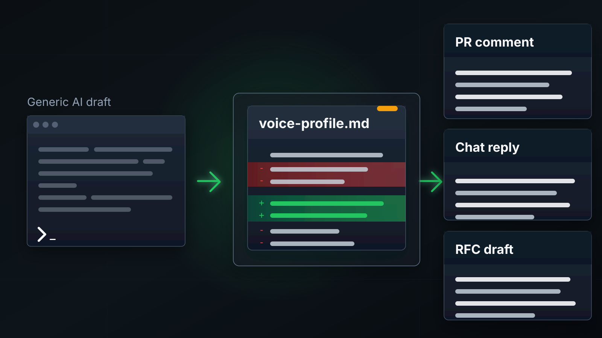
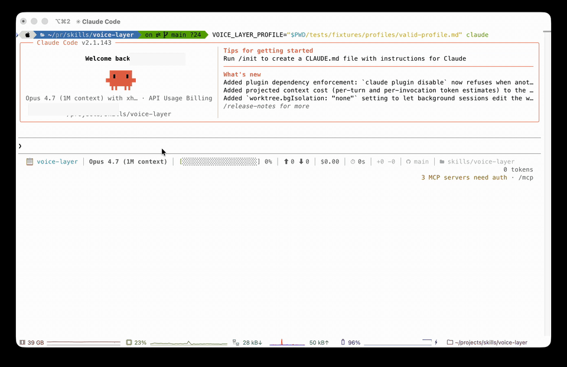

# voice-layer

<p align="center">
  
</p>

A local-first personal voice layer for AI agents.

Bring your voice to any agent.
Adapt to any audience without losing yourself.

Turn generic AI drafts into calibrated PR comments, Slack replies, docs, RFCs,
and emails.


`voice-layer` gives Claude Code and Codex a reusable local profile for writing
like you: direct where you are direct, careful where you are careful, and shaped
for the channel without flattening into generic AI prose.



```text
generic AI draft + local voice-profile.md -> PR comment | Slack reply | RFC | email
```



The demo uses only the synthetic profile in this repo.

## Install

Homebrew install after the first public release:

```sh
brew tap ymeiri/voice-layer
brew install voice-layer
voice-layer install --agent both
voice-layer doctor --agent both
```

Remove skills while preserving your profile:

```sh
voice-layer uninstall --agent both
```

Delete local profile data only when you explicitly mean it:

```sh
voice-layer purge --yes
```

Clone-based install also works:

```sh
./voice-layer install --agent both
./voice-layer doctor --agent both
```

This repo currently ships the reference implementation as two Agent Skills:

- `write-in-my-voice`: drafts or rewrites Slack replies, emails, PR
  descriptions, review comments, docs, design docs, RFCs, issue updates, and
  similar text.
- `calibrate-my-voice`: builds a local voice profile from samples you
  explicitly approve.

The repo and plugin packages use the `voice-layer` name. The commands are
verbs: one for writing, one for calibration.

Current packaged support is Claude Code and Codex. "Bring your voice to any
agent" is the long-term direction; Cursor and other agents are not claimed as
supported until their package and invocation behavior are verified. See
[docs/support-matrix.md](docs/support-matrix.md).

Why this is not just a prompt:

- **Local profile:** inspectable `voice-profile.md`, stored outside the repo.
- **Consent-first calibration:** the agent asks before reading private sources.
- **Channel-aware output:** PR comments, Slack replies, docs, RFCs, and email
  get different shapes from the same facts.
- **AI-tell cleanup:** repeated model phrasing, filler, and punctuation tells
  are explicitly checked.
- **CI privacy guard:** executable repo code is scanned for silent
  network/telemetry paths.

## Why This Exists

AI agents are good at producing text. They are much worse at preserving the
person behind the text.

Most AI-polishing tools remove a few cliches. That is not enough. Real writing
depends on voice, channel, audience, context, document shape, and boundaries. A
message can be more corporate-friendly, more direct, or easier for a different
audience to read without erasing the person who wrote it. A design doc can also
keep the user's structure, depth, risk framing, and decision style.

`voice-layer` treats style as a portable profile:

```text
voice + vibe + channel + audience + guardrails -> usable draft
```

## What Is Different

- **Portable profile:** your calibrated voice is stored as an inspectable local
  file that agents can reuse.
- **Consent-first calibration:** the agent must ask before reading private
  sources such as Slack, email, docs, PRs, or project tools.
- **Audience adaptation:** the goal is to adapt for readers without turning
  cultural or regional language into a costume.
- **Documentation style:** design docs, RFCs, ADRs, runbooks, and wiki pages can
  preserve how the user structures context, alternatives, risks, and decisions.
- **AI-tell cleanup:** the repo includes a public catalog of patterns that make
  AI writing sound fake: [AI_TELLS.md](AI_TELLS.md).
- **Spec-first direction:** the profile model is documented in
  [VOICE_PROFILE_SPEC.md](VOICE_PROFILE_SPEC.md).

## Zero-Data Demo

You can test the core loop without connecting Slack, Google Docs, GitHub,
email, or any private workspace. The repo includes a synthetic profile at
[tests/fixtures/profiles/valid-profile.md](tests/fixtures/profiles/valid-profile.md).

Install the Claude Code skill from this checkout, then launch Claude Code with
the bundled profile:

```sh
./voice-layer install --agent claude --mode symlink
VOICE_LAYER_PROFILE="$PWD/tests/fixtures/profiles/valid-profile.md" claude
```

Then ask Claude Code:

```text
/write-in-my-voice draft a PR comment from this:

Change parseWidgetConfig() in src/widgets/config.ts.
Goal: fix FOO-123.
Behavior is behind ENABLE_WIDGET_V2=true.
Tests: npm test -- widgets/config.test.ts.
Concern: we should make sure invalid widget types still return the existing validation error.
```

A real zero-data Claude Code run produced:

```text
Patch parseWidgetConfig() in src/widgets/config.ts for FOO-123. Gated on
ENABLE_WIDGET_V2=true.

One thing to confirm before this lands: invalid widget types should still
return the existing validation error, not fall through to the new path. Worth
an explicit test case alongside npm test -- widgets/config.test.ts.
```

The same facts can be shaped for another channel:

```text
/write-in-my-voice make this suitable for a short Slack update to the team:

Change parseWidgetConfig() in src/widgets/config.ts.
Goal: fix FOO-123.
Behavior is behind ENABLE_WIDGET_V2=true.
Tests: npm test -- widgets/config.test.ts.
Concern: invalid widget types should still return the existing validation error.
```

Output:

```text
Patching parseWidgetConfig() in src/widgets/config.ts for FOO-123, gated on
ENABLE_WIDGET_V2=true. Tests: npm test -- widgets/config.test.ts. Watch item:
invalid widget types should still hit the existing validation error. Flagging
in case anyone sees otherwise.
```

The broader synthetic example set lives in [examples/README.md](examples/README.md).
No examples are based on a real person.

## Clone Install

From a clone of this repo, if you are not using Homebrew:

```sh
./voice-layer install --agent both
./voice-layer doctor --agent both
```

Restart Claude Code or Codex after installing.

The CLI links the skills into:

- Claude Code: `~/.claude/skills`
- Codex: `~/.agents/skills`

It also creates the local profile path:

```text
~/.config/voice-layer/voice-profile.md
```

Preview file changes before installing:

```sh
./voice-layer install --agent both --dry-run
```

Remove skill links without deleting your profile:

```sh
./voice-layer uninstall --agent both
```

Delete local profile data only with an explicit purge:

```sh
./voice-layer purge --yes
```

For Homebrew, plugin/marketplace installs, uninstall, and troubleshooting, see
[docs/install.md](docs/install.md).

## First Use

Before calibration, `write-in-my-voice` can still remove generic AI writing
patterns, but it does not know your voice yet.

Claude Code:

```text
/write-in-my-voice rewrite this Slack reply:
Great question! It is important to note that we could potentially leverage this robust approach.
```

Codex:

```text
Use $write-in-my-voice to rewrite this Slack reply:
Great question! It is important to note that we could potentially leverage this robust approach.
```

## Calibrate

Start calibration when you want the skill to learn your style:

```text
/calibrate-my-voice build my local voice profile.
```

The calibrating agent should first inspect what source tools are available in
the current session, then ask which sources it may use. It can work from pasted
samples, exports, local git commits, code reviews, chat, email, docs, or
project-management tools such as Linear, Jira, Asana, Monday.com, or internal
trackers.

It must not read any source until you approve the source, scope, date range,
author filter, and retention mode.

## Voice, Vibe, Audience

`voice-layer` separates stable identity from temporary adaptation:

- **Voice:** the user's calibrated writing baseline.
- **Vibe:** a temporary overlay such as `corporate-friendly` or
  `chill-rock-star`.
- **Channel:** Slack, email, PR review, docs, issue tracker, or another surface.
- **Audience:** the reader and how much context or formality they need.
- **Document shape:** the expected structure and depth for docs, RFCs, ADRs,
  runbooks, and design docs.
- **Localization:** clarity and convention adjustments, not cultural mimicry.

The key rule:

```text
Voice is portable. Culture is not a costume.
```

## Privacy

This repo does not include a hosted service, telemetry, or personal samples.
CI runs a static no-silent-telemetry guard over executable repo code:

```sh
python3 scripts/check_no_silent_telemetry.py
```

The generated profile stays local by default at:

```text
~/.config/voice-layer/voice-profile.md
```

Read [PRIVACY.md](PRIVACY.md) before calibrating from private workspaces.

## Validate

```sh
python3 scripts/sync_core.py --check
python3 scripts/validate_repo.py
python3 scripts/check_no_silent_telemetry.py
python3 scripts/validate_profile.py ~/.config/voice-layer/voice-profile.md
python3 scripts/evaluate_examples.py
python3 scripts/evaluate_behavior.py
python3 scripts/evaluate_behavior.py --print-pilot-prompts
python3 -m unittest discover -s tests
```

## Project Docs

- [AI_TELLS.md](AI_TELLS.md): public catalog of common AI writing patterns.
- [VOICE_PROFILE_SPEC.md](VOICE_PROFILE_SPEC.md): portable profile model.
- [core/profile/schema.json](core/profile/schema.json): machine-readable
  profile schema.
- [docs/install.md](docs/install.md): install, plugin, and uninstall details.
- [docs/evaluation.md](docs/evaluation.md): current evaluation tiers.
- [docs/visual-identity.md](docs/visual-identity.md): logo, visual language,
  and Nano Banana prompt pack.
- [evals/behavior/scenarios.json](evals/behavior/scenarios.json): behavioral
  eval scenarios for writing, calibration, privacy, and audience adaptation.
- [scripts/validate_profile.py](scripts/validate_profile.py): local voice profile
  validation.
- [docs/support-matrix.md](docs/support-matrix.md): verified support status.
- [docs/implementation-roadmap.md](docs/implementation-roadmap.md): path to a
  complete multi-agent implementation.

## References

- [Agent Skills specification](https://agentskills.io/specification)
- [Codex skills](https://developers.openai.com/codex/skills)
- [Claude Code plugins](https://code.claude.com/docs/en/plugins)
